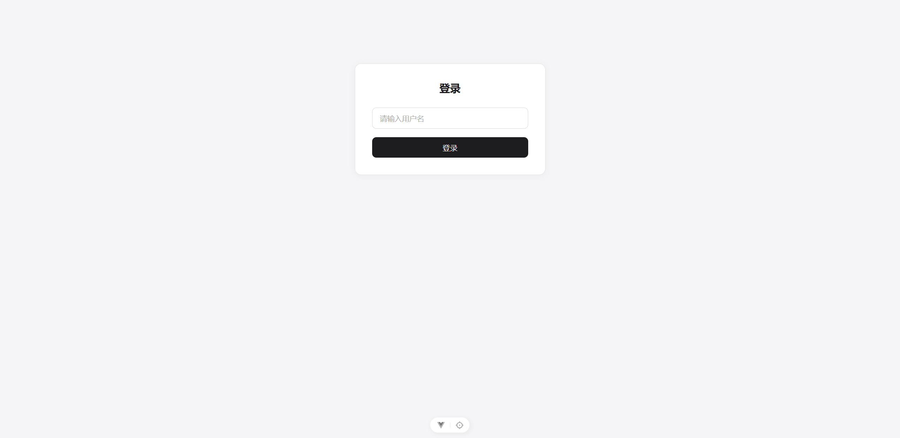
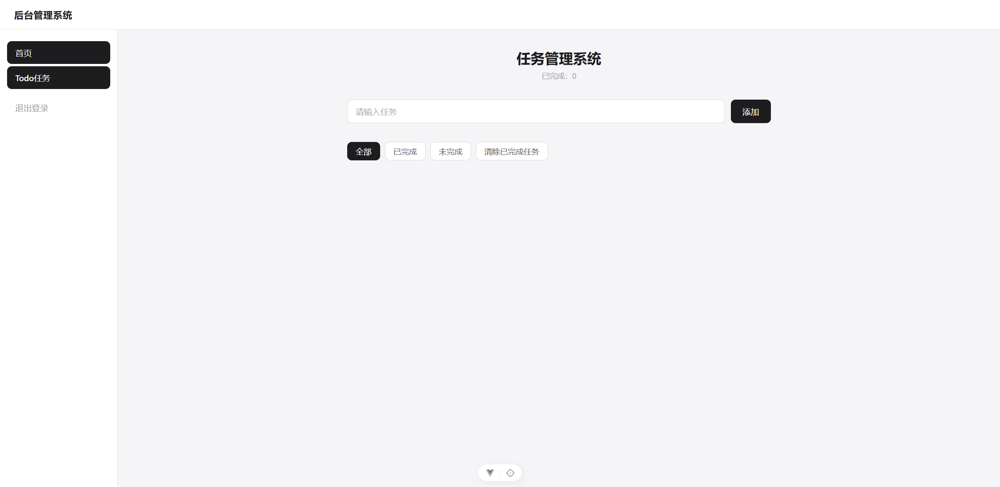
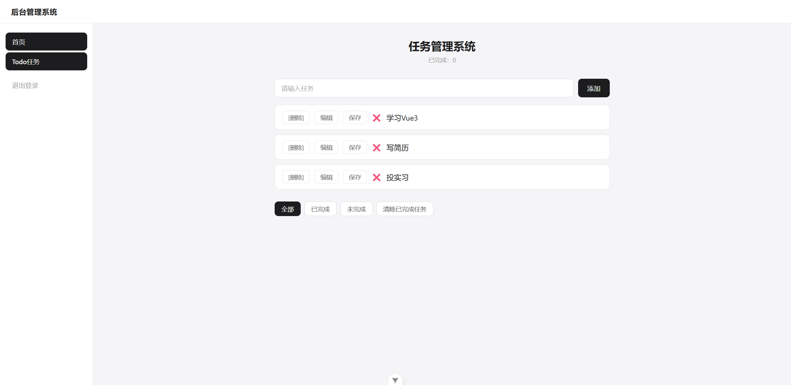

# Task Manager（任务管理系统）

一个基于 **Vue 3** 的前后端分离任务管理应用，覆盖登录鉴权、任务 CRUD、筛选与本地持久化。用于练习 Vue 工程化、HTTP 分层与部署流程。

## ✨ 功能

- 🔐 登录 / 退出（本地 mock 鉴权，token 存 localStorage）
- ✅ 任务增删改查（添加、删除、编辑、完成状态切换）
- 🔍 任务筛选（全部 / 已完成 / 未完成）
- 🧹 一键清除已完成任务
- 📊 完成数量统计
- 💾 **双存储模式**：本地开发走 json-server mock 后端；线上部署自动降级 localStorage，保证完整可用

## 🛠 技术栈

| 层 | 技术 |
|---|---|
| 框架 | Vue 3（Composition API + `<script setup>`） |
| 构建 | Vite |
| 状态管理 | Pinia |
| 路由 | Vue Router |
| HTTP | Axios（请求/响应拦截器） |
| 后端（开发） | json-server（mock） |
| 测试 | Vitest |

## 📁 项目结构

```
src/
├─ api/          # API 请求函数
├─ service/      # 业务层（可切换 API / localStorage 模式）
├─ stores/       # Pinia 状态
├─ utils/        # 工具（request 封装、storage、error）
├─ constants/    # 常量
├─ components/   # 通用组件
├─ layouts/      # 布局
├─ views/        # 页面
└─ router/       # 路由
```

## 🚀 本地运行

```bash
# 1. 安装依赖
npm install

# 2. 启动 mock 后端（端口 3000）
npm run mock

# 3. 另开终端启动前端（端口 5173）
npm run dev
```

访问 http://localhost:5173 ，任意输入用户名即可登录。

## ☁️ 部署说明

线上部署（如 Vercel）时，由于没有后端，通过环境变量切换到本地存储模式：

```
VITE_USE_LOCAL_STORAGE=true
```

配置后，任务数据会持久化到浏览器 localStorage，无需后端即可完整使用。

## 🧪 测试

```bash
npm run test
```

## 🧠 技术难点与收获

### 1. 双存储模式（API 优先，localStorage 降级）

线上部署（静态托管）没有后端可用，但项目又不能因此"瘫痪"。解决方案是在 service 层做了一层抽象：

```js
// service/todoService.js
const useLocalStorage = import.meta.env.VITE_USE_LOCAL_STORAGE === 'true'

export async function fetchTodos() {
  if (useLocalStorage) return readLocalTodos()   // 本地存储模式
  const res = await getTodoList()                 // API 模式
  return res.data
}
```

- **好处**：业务层（store）完全感知不到存储方式的差异，切换模式只改一个环境变量
- **收获**：理解了"接口抽象"的意义——上层依赖接口而非实现，这也是后端/微服务设计里的核心思想

### 2. Axios 请求/响应拦截器

统一在 request 层处理"带 token"和"错误收集"，业务代码不用重复写：

```js
request.interceptors.request.use(config => {
  const user = getItem(USER_KEY)
  if (user?.token) config.headers.Authorization = `Bearer ${user.token}`
  return config
})
```

### 3. 四层职责分离

```
Vue 组件 → stores（Pinia）→ service（业务）→ api（请求）→ Axios
```

每层只做一件事：组件管 UI，store 管状态，service 管数据来源，api 管 HTTP。改接口契约时只需要动 api 层，不影响上层。

### 4. SPA 部署的坑：History 路由刷新 404

部署到静态托管后，直接访问 `/todo` 会 404（服务器找不到这个"文件"）。解决方案是 `vercel.json` 的 rewrites 把所有路径回退到 `index.html`，由前端路由接管：

```json
{ "rewrites": [{ "source": "/(.*)", "destination": "/index.html" }] }
```

### 5. 单元测试

用 Vitest 给 store 的 getters/actions 和工具函数写测试（9 个用例），覆盖筛选逻辑、完成统计、localStorage 读写等纯逻辑，不依赖 DOM。

## 📸 截图

| 登录页 | 任务列表 |
|---|---|
|  |  |

| 添加任务 | 刷新后数据持久化 |
|---|---|
|  |  |

---

*学习项目：Vue 3 前端工程化练习*
